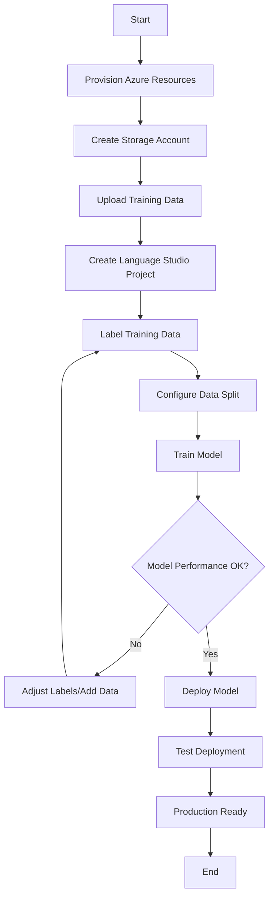
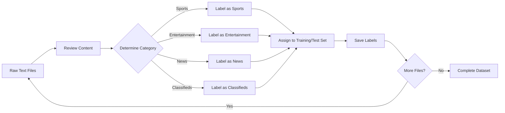
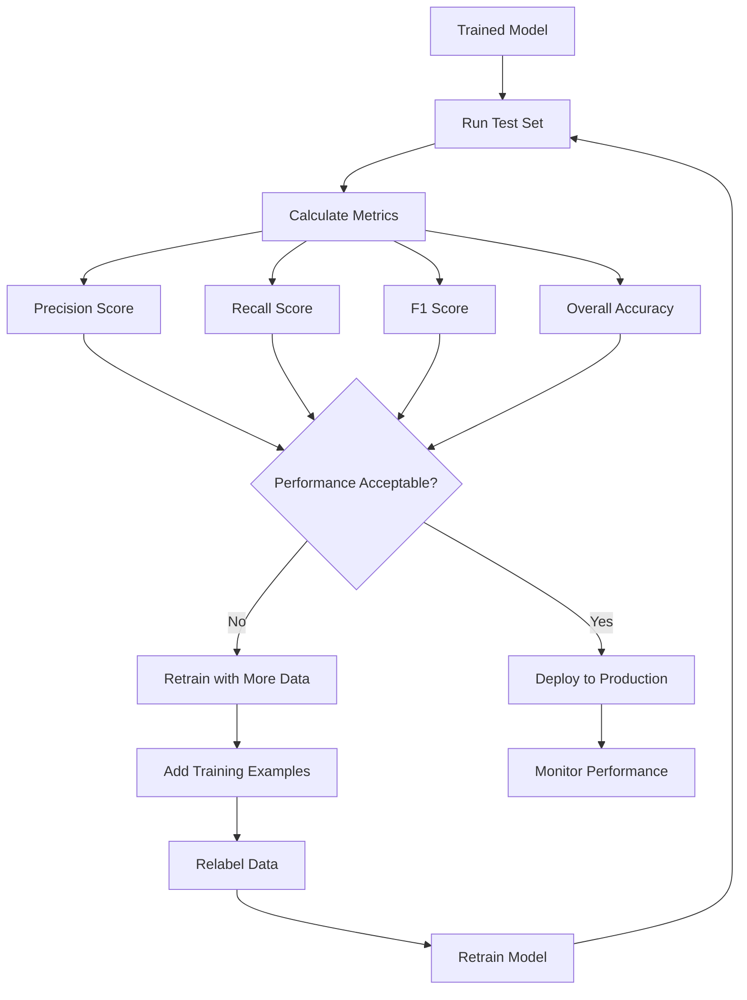
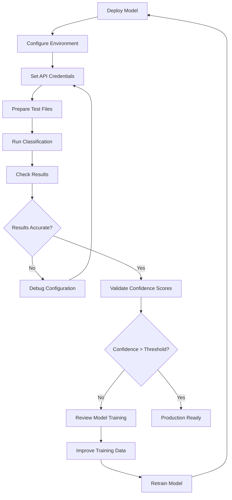

# Custom Text Classification with Azure AI Language

A Python application that uses Azure AI Language service to classify text documents into predefined categories.

## Features

- Batch text classification using Azure AI Language
- Processes multiple text files from a directory
- Returns classification results with confidence scores

## Setup

1. Clone the repository
2. Create a virtual environment:
   ```bash
   python -m venv .venv
   source .venv/bin/activate  # On Windows: .venv\Scripts\activate
   ```
3. Install dependencies:
   ```bash
   pip install -r requirements.txt
   ```
4. Configure environment variables in `.env`:
   ```
   AI_SERVICE_ENDPOINT=your_azure_endpoint
   AI_SERVICE_KEY=your_azure_key
   PROJECT=your_project_name
   DEPLOYMENT=your_deployment_name
   ```

## Usage

1. Place text files in the `articles/` directory
2. Run the application:
   ```bash
   python app.py
   ```

## Complete Workflow Process

### Model Training and Deployment Pipeline



### Data Labeling Process



### Model Evaluation Workflow



### Application Testing Process



## Sample Results

When running with the provided test files:

```
test2.txt was classified as 'Sports' with confidence score 0.33.
test1.txt was classified as 'Entertainment' with confidence score 0.33.
```

## Requirements

- Python 3.7+
- Azure AI Language service resource
- Trained custom classification model

## References

- [Azure AI Text Analytics SDK](https://pypi.org/project/azure-ai-textanalytics/)
- [Microsoft Learn AI Language Repository](https://github.com/microsoftlearning/mslearn-ai-language)

## File Structure

```
├── app.py              # Main application
├── requirements.txt    # Dependencies
├── .env               # Environment variables
└── articles/          # Text files to classify
    ├── test1.txt
    └── test2.txt
```
